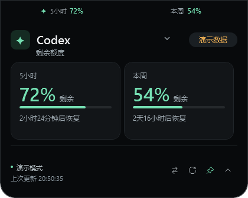
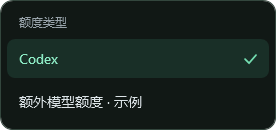

# Codex Island · Windows

把 Codex 剩余额度放在桌面上，抬眼就能看到。

Codex Island 是一个轻量的桌面悬浮工具。平时以小胶囊显示额度，鼠标移入即刻展开，查看不同模型的剩余比例与恢复时间。

*截图为演示数据；运行时默认显示你当前 Codex 账号的实际额度。*

## 能做什么

- **随时查看额度**：显示剩余百分比、额度周期和预计恢复时间。
- **切换额度类别**：在标题旁的菜单中切换账号返回的不同模型额度。
- **悬停展开、点击固定**：快速查看，也可以让详情一直留在桌面上。
- **调整位置和大小**：拖到习惯的位置，按显示器保存位置与显示大小。
- **后台自动更新**：定期刷新，也支持手动刷新；读取失败时保留上次的数据并提示。
- **托盘控制**：隐藏、重新显示、调整设置或退出，均可从任务栏通知区域操作。

## 开始使用

### 准备

- 在 Windows 本机安装 Codex，并使用有订阅额度的 ChatGPT 账号登录。
- 当前已验证的环境是 **Windows 11 x64**。推荐使用 `win-x64` 便携包。
- 标准便携包自带运行环境，无需另外安装 .NET 或开发工具。

仅在 WSL 内安装或登录 Codex，不能代替 Windows 本机登录。

### 打开程序

1. 获取 `Codex-Island-<版本>-win-x64.zip`，解压到你希望长期存放的位置。
2. 双击文件夹中的 **`CodexIsland.exe`**。
3. 等待首次读取完成。灵动岛会出现在屏幕顶部，任务栏通知区域会出现小柱状图图标。

发布包可查看仓库的 [Releases 页面](https://github.com/Er-Ding/codex-Island/releases)。若没有对应的发布包，可按 [构建说明](windows/docs/DEVELOPMENT.md) 从源码生成。

## 日常操作

| 想做什么 | 怎么操作 |
| --- | --- |
| 查看详情 | 将鼠标移入灵动岛，立即展开；移出后稍等自动收起 |
| 保持展开 | 点击顶部胶囊，或点击详情区的图钉 |
| 收起面板 | 点击向上箭头；手动收起后，移出再移入才会重新展开 |
| 切换模型额度 | 点击详情区的模型名称或旁边的小箭头 |
| 立即更新 | 点击详情区的刷新图标，或在托盘菜单中选择“刷新额度” |
| 暂时隐藏 / 显示 | 左键点击任务栏通知区域的小柱状图图标 |
| 退出 | 右键托盘图标，选择“退出 Codex Island” |

### 调整位置

1. 点击详情区的“调整位置”按钮，或在托盘菜单中选择“调整位置…”。
2. 按住“拖动调整位置”区域，拖到目标位置或另一块显示器。
3. 点击“完成”保存。点击 × 则取消本次调整。

保存后，重启仍会恢复位置。需要回到顶部时，在托盘菜单中选择“恢复默认位置”。

### 调整大小

右键托盘图标 → **显示大小**，选择自动适配或 100%–200% 的大小。每块显示器可以使用不同的设置。

## 如何理解额度

- 百分比表示**剩余**，不是已使用。剩余不超过 25% 时显示橙色，不超过 10% 时显示红色。
- 周期和类别以账号实际返回的数据为准。只有一个周期时，面板只显示一张卡片。
- 后台通常每 30 秒更新一次。读取失败时会延后重试，你也可以点击刷新。
- 遇到连接问题，面板会保留上次成功的数据，并显示提示和上次更新时间。
- 到了预计恢复时间，仍需下一次成功读取才能确认额度已恢复。

## 常见问题

**提示未找到 Codex？** 先确认 Windows 版 Codex 能正常打开并已登录。随后右键托盘图标 →“选择 Codex 程序…”，选择本机的 `codex.exe`；也可以选择“自动查找 Codex”后重试。

**一直没有额度或只有横线？** 确认使用的是有订阅额度的 ChatGPT 账号，检查网络后点击刷新。API 密钥登录不一定提供这里显示的订阅额度。

**找不到悬浮窗？** 在任务栏右侧的隐藏图标区域找到小柱状图，点击它重新显示；如果位置不合适，选择“恢复默认位置”。再次启动程序也会显示已有窗口。

**怎样更新？** 先从托盘退出旧版，再解压新版替换程序文件。位置和大小保存在 `%LOCALAPPDATA%\CodexIsland\settings.json`，替换程序不会清除这些设置。

**会自动开机启动吗？** 当前不会自动设置开机启动，也没有内置自动更新。

## 平台与分支

两个平台分别维护，构建脚本和开发文档也放在各自的平台目录中。

| 分支 | 平台目录 | 用途 |
| --- | --- | --- |
| `Windows` | `windows/` | Windows 版；当前使用指南对应此分支 |
| `macOS` | `macos/` | macOS 版，保留原有 Swift 应用与说明 |

本地可通过 `git switch Windows` 或 `git switch macOS` 切换；首次获取远程平台分支时见 [开发说明](windows/docs/DEVELOPMENT.md#平台分支)。`main` 暂保留原有历史基线。

需要构建、测试或排查问题，请阅读 [开发说明](windows/docs/DEVELOPMENT.md)。

## 许可

本项目采用 [MIT License](LICENSE)。Codex Island 是独立社区项目，与 OpenAI 无隶属关系。
