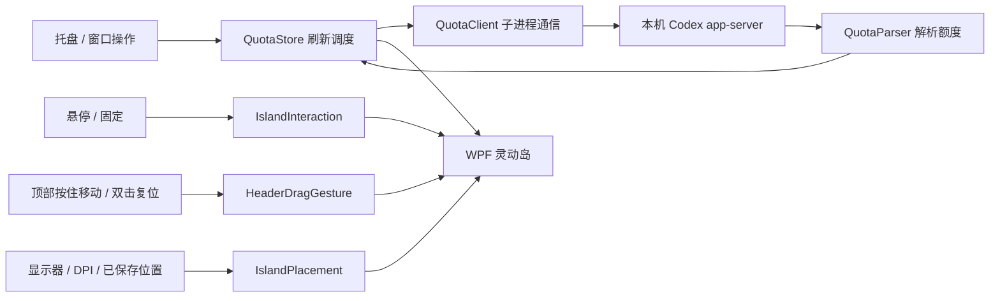

# Windows 适配：逻辑与实现

## 原应用的数据流

基于仓库 macOS 提交 `0043137` 梳理。`IslandApp` 创建状态仓库、窗口和菜单栏图标；`QuotaStore` 控制刷新；`QuotaClient` 管理独立的 Codex 子进程；`QuotaModels` 解析额度；`IslandView` 展示当前额度类别。`IslandPanel` 是窗口、动画、屏幕环境和交互状态的协调者。

不是从日志累计 token 推算额度。采用官方账号额度接口，由 Codex 自身管理认证与服务访问。多额度优先取 `rateLimitsByLimitId`，旧 `rateLimits` 只补缺失项；已用值转成剩余值后限制在 0–100。周期与恢复时间保留服务实际返回的含义。

## 为什么单独增加 WPF 实现

现有项目依赖 SwiftUI、AppKit、CoreGraphics 和 Darwin，界面与 macOS 窗口代码不能直接编译到 Windows。这个工具的核心需求是一个小型透明、置顶、不抢焦点的原生窗口。WPF 能直接承担这些职责，Win32 补充窗口风格、物理屏幕坐标和显示器 DPI，WinForms 仅用于系统托盘。项目不依赖额外 NuGet 包。

Windows 在 `Windows` 分支的 `windows/` 目录中维护。当前最新 macOS 来源是远端 `main` 的 `Sources/CodexIsland/`，本地 `macOS` 分支仍为早期隔离目录快照。业务规则采用等价的 C# 实现，通过测试保持一致，当前不建立 Swift/C# 跨语言运行时共享。

## 模块对应

| macOS 文件 | Windows 文件 | 适配内容 |
| --- | --- | --- |
| `QuotaModels.swift` | `Core/QuotaModels.cs` | 相同的额度优先级、周期、剩余值与错误文案策略 |
| `QuotaClient.swift` | `Core/QuotaClient.cs`、`CodexLocator.cs`、`JsonLineBuffer.cs` | Windows exe 发现、隐藏子进程、UTF-8 行协议、请求关联、超时、重连 |
| `QuotaStore.swift` | `Core/QuotaStore.cs` | 合并同时刷新、30 秒调度、失败退避、保留旧快照、取消 |
| `IslandState`、`HoverTracking.swift` | `Core/IslandInteraction.cs` | 进入立即展开、离开延迟、手动收起抑制、固定、菜单和调整模式 |
| Windows 专属手势 | `Core/HeaderDragGesture.cs`、`Windows/IslandWindow.HeaderDrag.cs` | 顶部按住即拖、单击固定、双击复位、鼠标捕获和松开保存 |
| `IslandPlacement.swift`、`IslandSizing.swift` | `Core/IslandGeometry.cs`、`SettingsStore.cs` | 工作区、顶部锚点、按屏幕设置、DIP 与像素转换 |
| `IslandPanel.swift`、`PositionDragHandle.swift` | `Windows/IslandWindow.xaml.cs`、`NativeMethods.cs` | HWND 风格、动画画布、拖动鼠标捕获、屏幕变化 |
| `IslandView.swift`、`IslandBucketMenu.swift` | `Windows/IslandWindow.xaml` | 胶囊、额度卡片、菜单和按钮 |
| `IslandApp.swift` | `Windows/Program.cs`、`TrayIcon.cs` | 入口、单实例、通知区域菜单、退出清理 |
| 各 Swift checks | `Checks/Program.cs`、`Windows/SmokeChecks.cs` | 无测试框架依赖的逻辑、进程与 WPF 检查 |
| `TaskActivityClient.swift`、`TaskActivityDecoder.swift` | `Core/TaskActivityClient.cs`、`TaskActivityDecoder.cs`、`TaskActivityProjection.cs` | Windows 命名管道、快照与增量、状态确认、任务摘要最小化 |
| `TaskActivityStore.swift`、`TaskActivityView.swift` | `Core/TaskActivityStore.cs`、`Windows/IslandWindow.Tasks.cs` | 独立轮询、断线保留、任务徽标与列表 |
| `TaskNavigator.swift` 及各来源导航 | `Windows/Task*Navigator.cs` | Desktop 链接、VS Code 活窗口定位、终端原会话与侧边聊天 UIA |

表内 Windows 路径以 `windows/CodexIsland.` 开头的项目目录为基准。

## Windows 特有处理

1. **子进程与安装路径**：查找本机实际存在的原生 exe，支持桌面 CLI 缓存及 npm 新旧目录；不执行 `.cmd` 包装器。通过参数列表传入命令，不拼接 shell 命令。继承用户环境，允许显式路径和 `CODEX_HOME`。
2. **生命周期**：通信串行化，所有请求都有时限；故障后重建连接。退出时取消刷新并只回收本应用启动的进程。Windows Job Object 在可用时进一步防止 UI 意外退出后残留子进程。
3. **焦点与托盘**：无边框透明窗口，加 `WS_EX_TOOLWINDOW` 和 `WS_EX_NOACTIVATE`，点击通过 `WM_MOUSEACTIVATE` 保持非激活。使用 `NotifyIcon`；重复启动向已存在的窗口发送显示消息。
4. **缩放和位置**：Win32 几何全部使用物理像素，WPF 布局使用 DIP。保存显示器 ID、横向比例、相对工作区顶部的 DIP 距离，按目标屏幕 DPI 转换一次。这样避开任务栏，也能表示左侧或上方的负坐标显示器。
5. **动画与命中**：移入事件立即触发展开，动画为 180 毫秒；移出事件配合指针轮询维护 280 毫秒的收起缓冲。窗口在过渡期间采用起止区域的并集画布，岛形状在其中变化，结束后裁去透明空间。画布透明区域不截获鼠标。悬停检测考虑当前可见范围和目标范围，避免展开到详情区时立刻收起。
6. **持久化**：设置按用户保存在 LocalAppData，采用临时文件替换。顶部拖动保存失败时恢复上次保存的位置并显示提示；托盘调整模式保存失败时保留草稿。损坏设置采用默认位置；外接屏暂时不存在时不覆盖原屏幕 ID。
7. **菜单与排版**：额度菜单使用自定义 WPF 模板，统一深色圆角、选中状态与字体。弹窗单独应用显示大小，打开时暂停自动收起，选择后释放保护。标题、数值与辅助文字采用统一层级，参考 [Geist](https://vercel.com/geist/typography) 和 [Fluent](https://fluent2.microsoft.design/typography)。
8. **顶部移动与复位**：展开后在顶部额度栏按住左键，首次物理坐标变化就开始拖动，没有长按时间或位移门槛。拖动期间暂停悬停收起，使用物理像素保持按压锚点；松开时按落点显示器重新计算大小、限制到工作区并保存。捕获丢失时取消草稿，恢复已保存位置。原地单击切换固定状态并保持展开，避免双击首击缩小第二击的命中区域；依据系统 ClickCount 识别第二击，未移动时松开复位到主屏顶部并收起，保留各屏幕大小设置。第二击发生移动时优先拖动；拖动后的点击不会误作复位。面板中的位置按钮已移除，托盘仍提供原有调整模式。

## 0.4.0 任务同步与 Windows 导航

- **接口**：核对本机 Desktop `26.908.4834.0`，连接已有 `codex-ipc` 命名管道；LE32 长度帧、初始化与订阅消息、任务流 version 11。后台每 3 秒更新任务视图，约 15 秒重查已加载候选；不启动任务、不建立远端连接。
- **启动补齐（0.4.1）**：发现来源包含会话索引、writer locks、Desktop client-id／tab-routes 缓存、项目归属及无项目会话。client-id 键中的 `local:` 是 UI scope，不能作为本机执行证据；结合明确的设备信息，并对已知设备上的未知归属会话请求现有 owner 快照。后台子任务从已知路由字段发现，不将终端 session ID 当成任务。
- **补订阅**：未收到快照时从 3 秒开始重试，逐步延长至 30 秒；重扫缓存保留从实时事件发现的任务，重连重新订阅。任务流快照也可补发现漏收初始通知的任务。最多并行订阅 256 项，非活动历史候选按探测时间轮换，真实 owner 通知可立即越过历史候选冷却；全局状态文件最多 16 MiB，其中候选探测最多 8192 项，超过限制显示部分待同步。
- **状态**：以确认的 runtime／turn 状态决定运行、等待或结束；断线、版本不兼容和 revision 缺口不视作完成，保留任务并提示。计划步骤优先，其次显示公开进展摘要及工具类型状态。
- **数据边界**：任务缓存只保留标题、状态、进度及导航所需字段，不持久化完整提问、原始推理、命令、工具参数或输出。侧边聊天仅保留首问投影后的页签名称。帧、缓存和订阅数有上限，覆盖不完整时明确显示。
- **界面**：缩略宽度 280 DIP、展开 420 × 486 DIP；额度卡片下增加任务列表，使用同套字体和深色滚动条。大比例在较小工作区中可滚动查看；徽标按下时冻结目标，移动优先拖动，双击额度区域复位。
- **导航**：Desktop 使用其已有会话链接；VS Code 依据实时进程、窗口 ID 与当前来源日志定位并重验；终端只接受可确认的进程／窗口／页签关联。原入口不明确时回退 Desktop，并给出原因。侧边聊天依据严格主会话路径和唯一页签名称，使用 Windows UI Automation 选择已有页签，焦点变化或取消后停止动作。
- **生命周期**：同步与导航使用独立取消控制，异步读取不阻塞 WPF；隐藏取消正在进行的定位，退出清理任务订阅及本应用拥有的诊断辅助进程。

## 验证与交付

Windows 0.3.3 的即刻拖动和顶部双击复位已通过 51 项核心检查、46 项 WPF 窗口检查和 28 项原生鼠标输入检查。运行方法、包位置、已验证环境和剩余实机验收项见 [开发说明](DEVELOPMENT.md)，日常操作见 [使用指南](../../README.md)。当前实现额度查询和主要交互，不添加账号管理、声音提醒、开机启动或额度重置。

Windows 适配涉及两个独立层面：额度通信已经在本机真实账号验证；显示器与窗口行为已经在本机单屏验证。多屏混合 DPI、唤醒和 ARM64 需要后续实机补充，不以数学模型测试替代。
